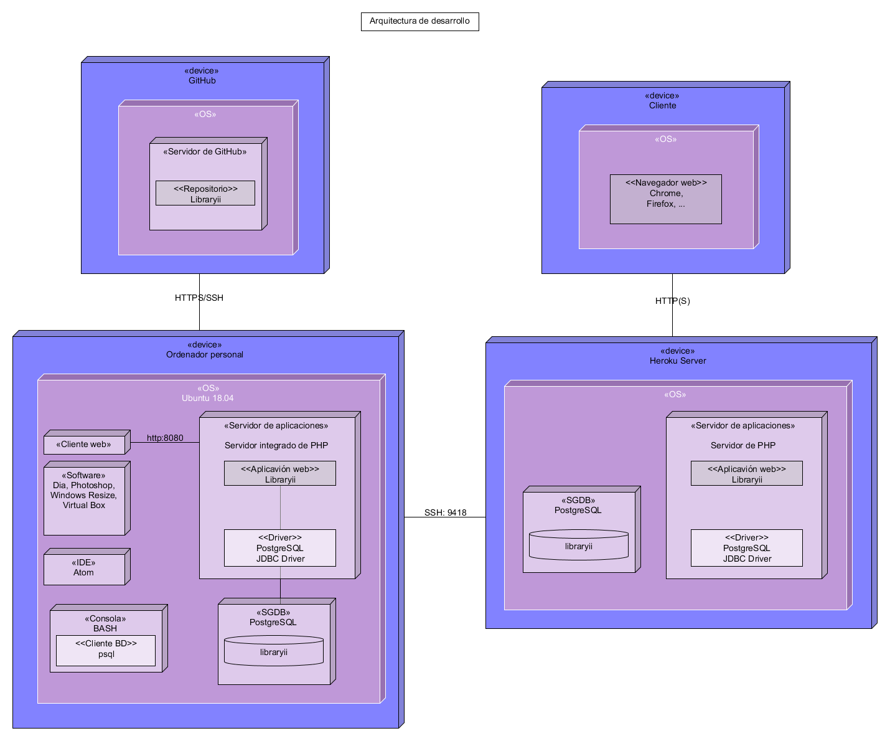
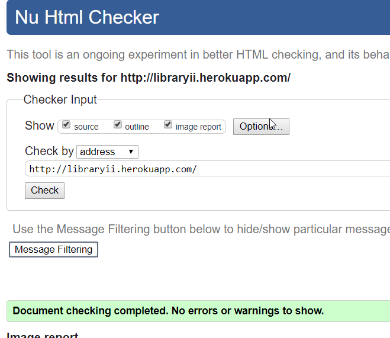
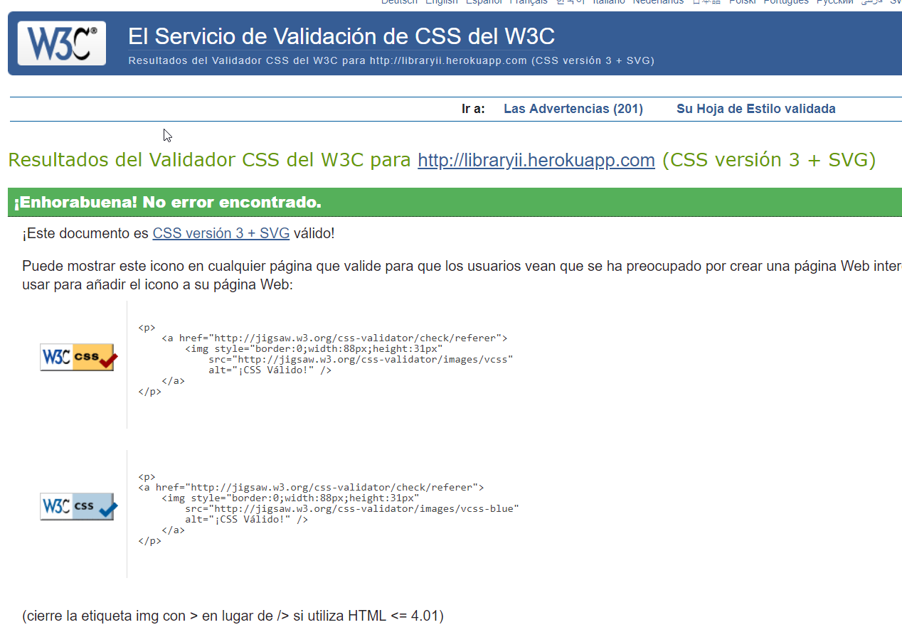
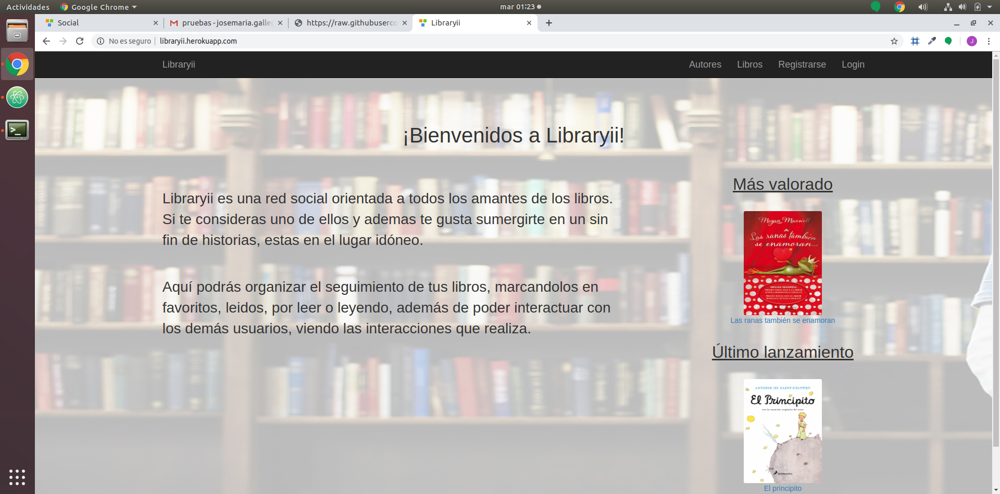
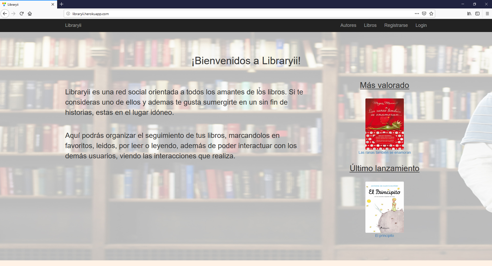
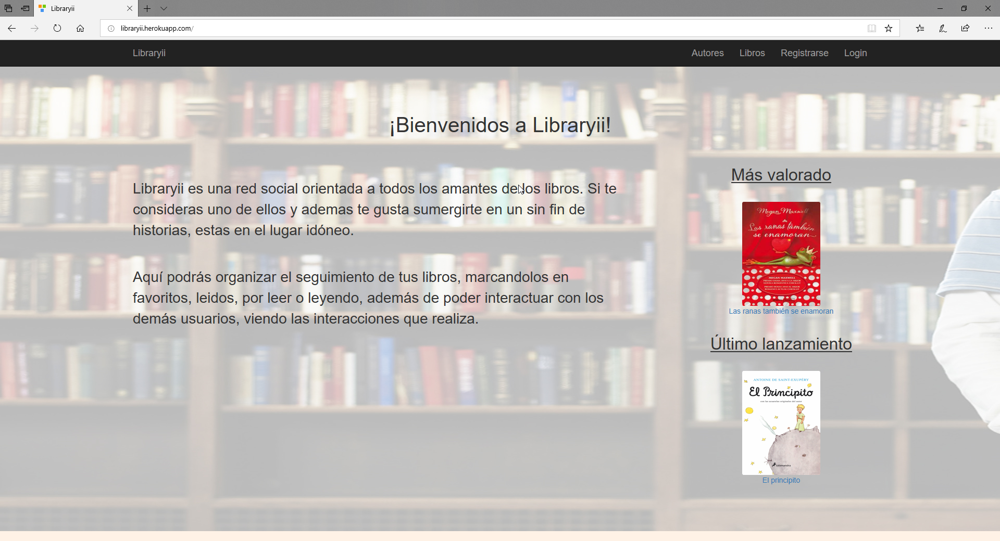

# Anexos

### **(R24) Despliegue en Heroku, (R38) Desplieue en Local**
---

### **(R68) Validación de HTML y CSS, nivel de accesibilidad AA y prueba del seis**
---
### Validación de HTML y CSS

**HTML**

[Enlace a la validación HTML](https://validator.w3.org/nu/?doc=http%3A%2F%2Flibraryii.herokuapp.com)

**CSS**

[Enlace a la validación CSS](https://jigsaw.w3.org/css-validator/validator?uri=http%3A%2F%2Flibraryii.herokuapp.com&profile=css3svg&usermedium=all&warning=1&vextwarning=&lang=es)

---

### Validación de accesibilidad

La página index cumple el nivel AA de accesibilidad.
---

### Prueba del seis

 1. ¿Qué sitio es éste?
- La aplicación tiene en todo momento elementos indicativos de que sitio es.  Abajo en el pié de página, esta también el nombre de la web. El menú de navegación y el pié de página se mantienen siempre, por lo que siempre está identificado el sitio.

 2. ¿En qué página estoy?
- Todas las páginas del sitio están identificadas por las migas de pan que te sitúan en todo momento.

 3. ¿Cuales son las principales secciones del sitio?
- Las principales secciones del sitio son *Autores*, *Libros*, *Registrarse*, *Login*, y además cuando estás logueado aparecen *Usuarios*, *Mi Perfil*, *Libraryii* (que es la parte SOCIAL).

 4. ¿Qué opciones tengo en este nivel?
- La navegación de cada nivel se realiza mediante botones para hacer uso de las diferentes acciones y pantallas.

 5. ¿Dónde estoy en el esquema de las cosas?
- En todas las páginas existe en la zona superior un indicador de bloque con las migas de pan.

 6. ¿Cómo busco algo?
- En la seccion de *Autores*, en la de *Libros* y en la de *Libraryii* (esta última cuando estamos logueados) disponemos de un buscador específico para esa sección. No existe un buscador genérico debido a la naturaleza de la propia aplicación.

---

### **(R36) Varios navegadores**

#### **Google Chrome**

---

#### **Mozilla Firefox**

---

#### **Microsoft Edge**

