# Manual de usuario

## Portada (Sin loguearse)
Nada más entrar, tenemos esta vista de la web, donde veremos una breve descripción, el libro mejor valorado y el último lanzamiento. Esta vista solo aparecerá si no estamos logueados.

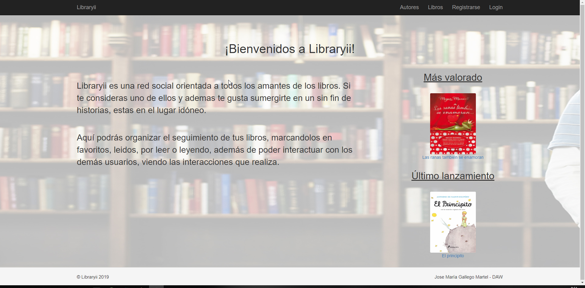

***

## Portada (Logueado)
Una vez un usuario se ha registrado (proceso fácil, sencillo e intuitivo), la página principal pasa a ser la parte 'Social' de la web, donde podremos ver los Posts propios y los de los usuarios a los que seguimos.

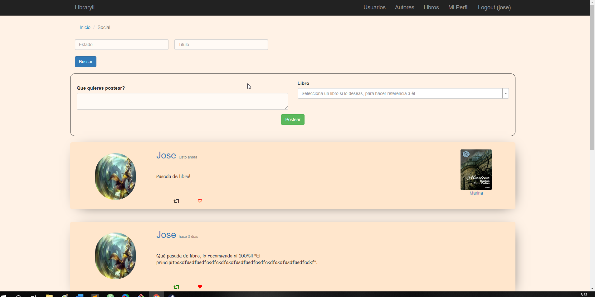

***

## Usuarios
Aquí podremos ver un listado de usuarios que están registrados en la web. Podremos buscar por login, ver sus perfiles, ...

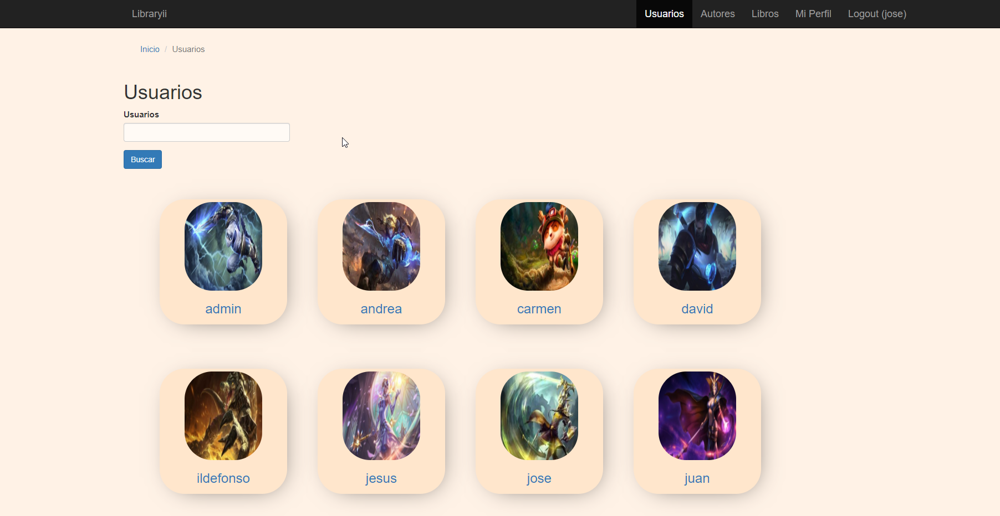

***

## Autores
Aquí podremos ver un listado de autores, con su buscador, ordenación y su paginador. Haciendo click sobre su nombre, podremos ver más información sobre él, como por ejemplo, todos los libros de este autor.

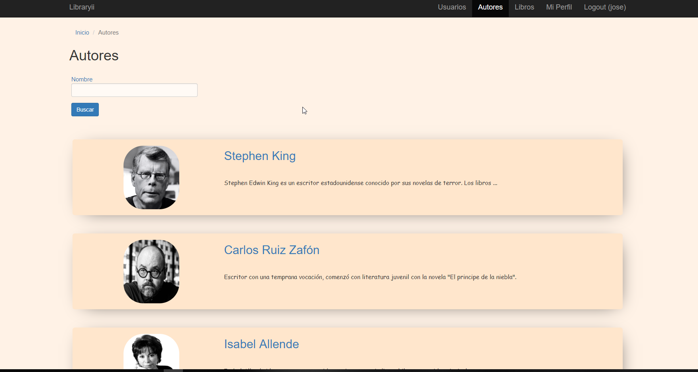

***

## Autor
Esta es la vista personalizada de un autor determinado. Podremos seguirlo desde esta pantalla, ver más información personal de este como todos los libros que tiene registrados en la web.

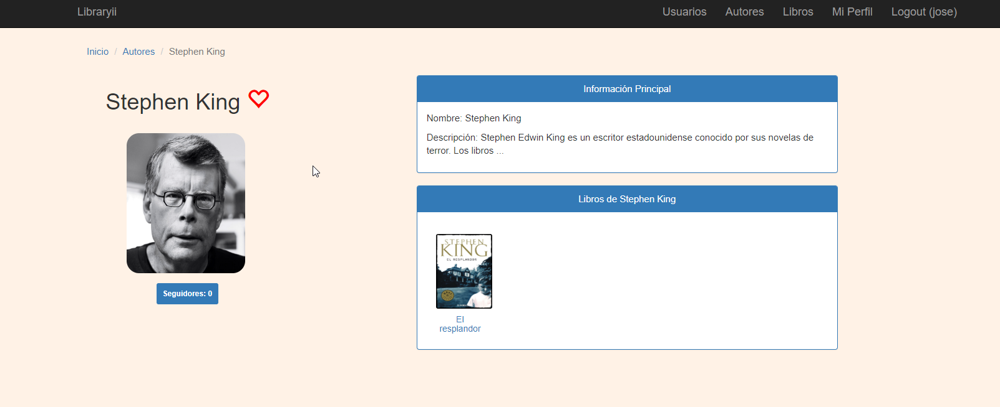

***

## Libros
Aquí podremos ver un listado de libros, un buscador muy completo, ... En cada libro, puedes ver si lo sigues o no, seguirlo, o establecer un seguimiento determinado. Si clickamos sobre el título, tendremos mucha más información sobre este libro.

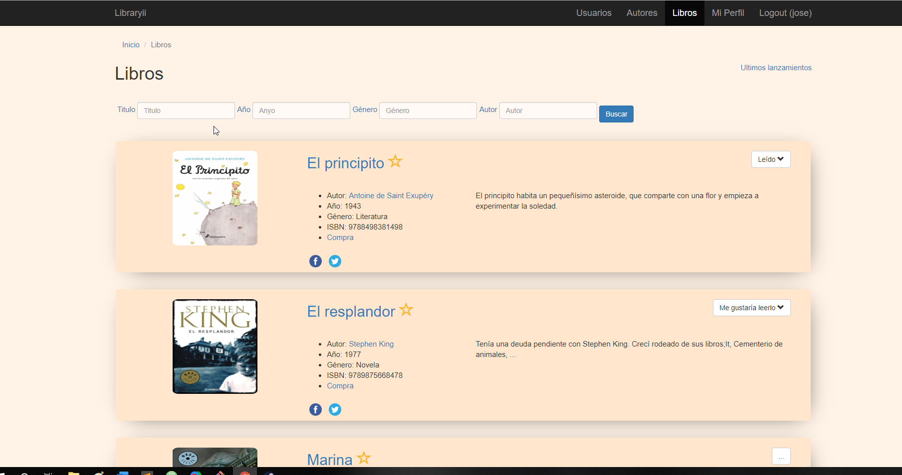

***

## Libro
Esta es la vista personalizada de un libro en particular. Tenemos toda la informaicón del libro. Nos muestra los seguimientos de los usuarios con este libro. Podemos valorar el libro y se actualiza la media de votos. También podemos comentar el libro.

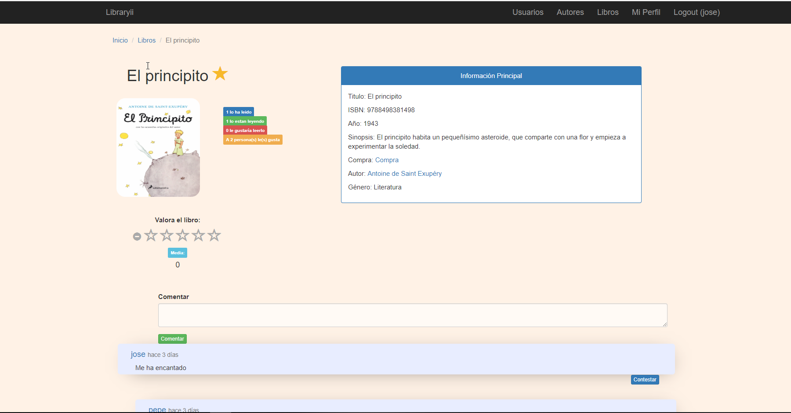

***

## Mi Perfil
Desde esta pantalla, podremos ver nuestra información personal. También tenemos la posibilidad de ver los seguimientos de los libros, los seguidores y los seguidos que tenemos. También podremos modificar el perfil o incluso eliminar nuestra cuenta. También vemos los libros que marcamos como favoritos.

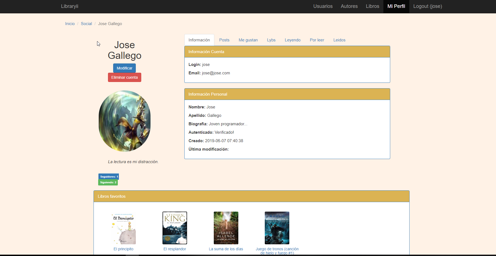

***

## Vistas dentro de 'Mi Perfil'
Desde 'Mi Perfil', tendremos la opción de ver los posts que he publicado, los posts que he marcado como favortios, los posts lybreados, y los libros que tengo en seguimiento ('Leyendo', 'Por leer', 'Leidos').

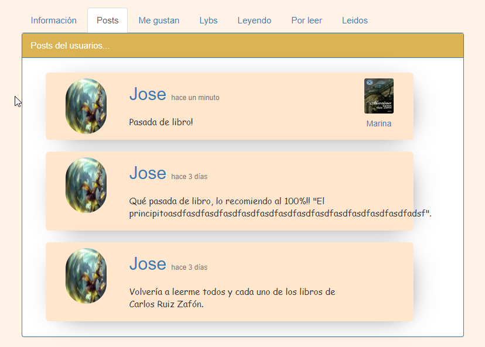

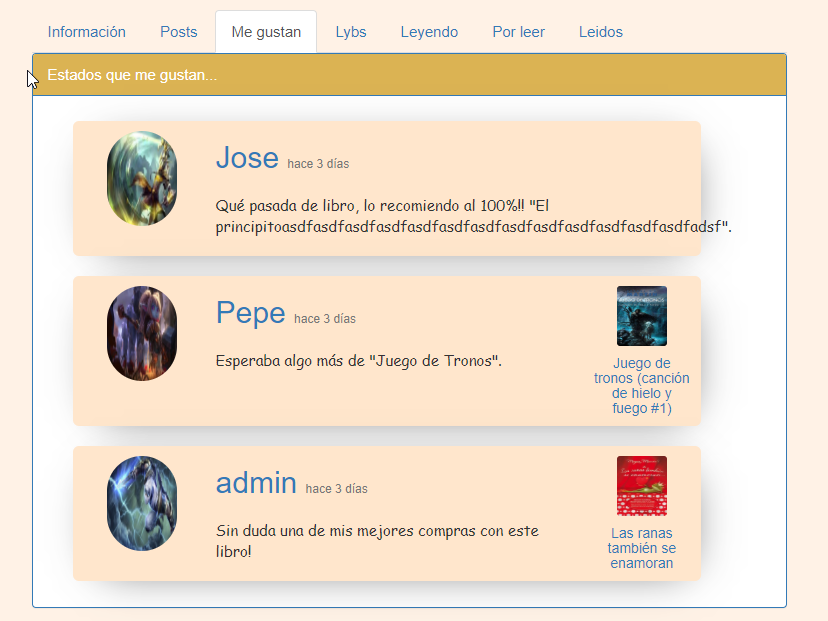

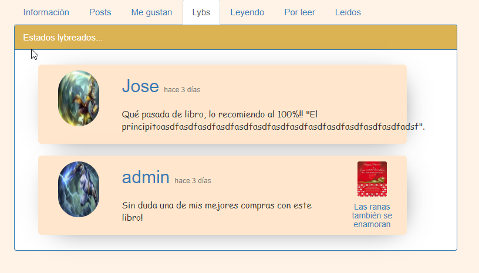

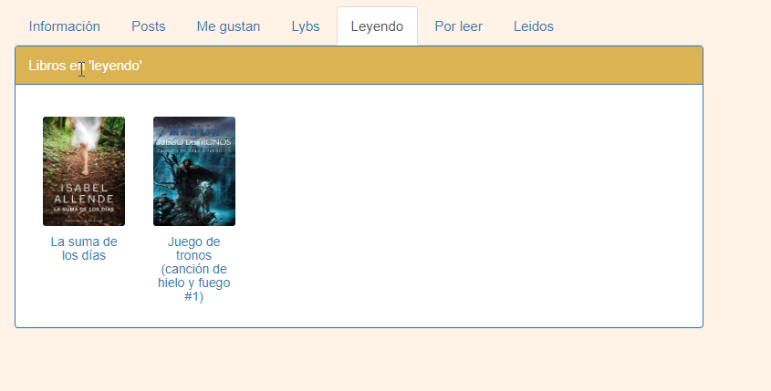

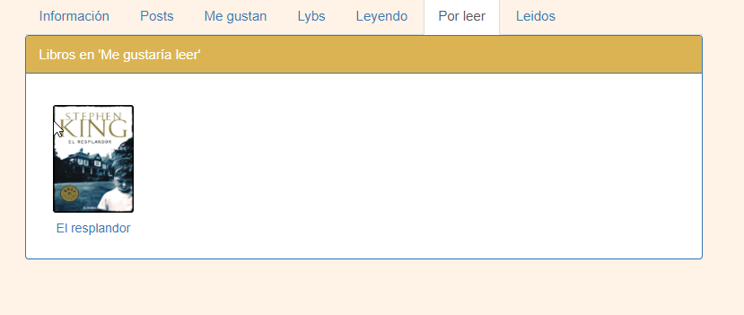

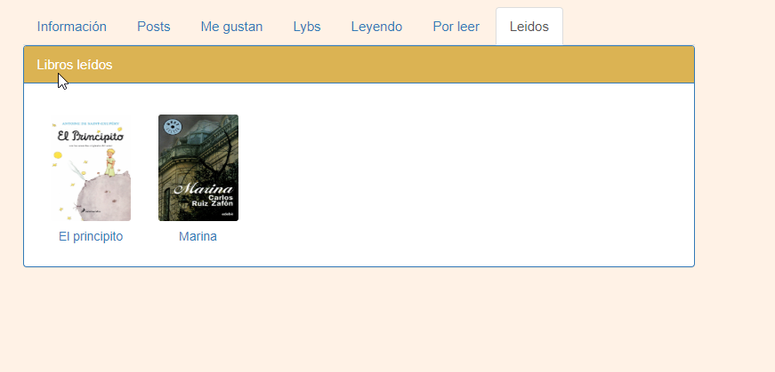

***
